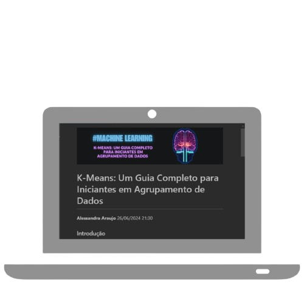

    

  
  

-------

  

# Projeto artigo técnico gerado por I.A.s

Projeto com o objetivo de gerar um artigo técnico usando Inteliencia Artificial.

<a href="https://github.com/alessalucas/prompts-for-article-generate-by-ia/blob/main/artigo.md" title="View PDF now"> 📕Clique aqui para ler o artigo</a>

## 💻 Tecnologias utilizadas no projeto

- [ChatGPT](https://chat.openai.com/) - para título e conteúdo
- [Lexica.art](https://lexica.art/) e [Removebg](ttps://www.remove.bg/pt-br)- para gerar imagens
- [Canva](https://www.canva.com/)  e [PowerPoint](https://www.microsoft.com/en/microsoft-365/powerpoint) - Para formatação de banners e Layouts

## 📄 Prompts e ferramentas

ChatGPT：

|   Ação   | prompt                                                                                                                                                                                                                                                                         |
| :------: | ------------------------------------------------------------------------------------------------------------------------------------------------------------------------------------------------------------------------------------------------------------------------------ |
|  título  | crie 10 headlines para nomes de artigos sobre o assunto Algoritmo K-Means dentro do ambito de Machine Learning |
| tópicos | além de introdução e conclusão, crie sub tópicos para o artigo com o titulo "K-Means: Um Guia Completo para Iniciantes em Agrupamento de Dados". Formule os tópicos de forma resumida, destacando os principais pontos. Crie tópicos sugestivos e que sejam chamativos para alunos iniciantes, com idade de 10 anos. |
| conteúdo | Com base  nos tópicos fornecidos, comporte-se como um escritor de artigos sobre Machine Learning e escreva um Artigo sobre o K-Means. O artigo deven conter: no máximo 5 linhas por blocos de explicação; me explique de maneira informal, como se eu fosse uma criança de 10 anos; cite exemplos com código; faça um call to action para as minhas redes sociais; coloque 3 hashtags que façam sentido; formule o artigo evitando analogias relacionadas a coisas infantis; escreva com detalhes relevantes o conteúdo de cada tópico. Inclua ao final: ilustrações de capa: gerada pela lexica.art; conteúdo gerado por: ChatGPT e revisões humanas |

Lexica.art：

- No léxica utilizamos o acervo público de imagens geradas por outras pessoas, os termos de pesquisa que utilizei durante a gravação do conteúdo foram:

• Machine Learning neon color

## ✨ Features

- Conteúdo gerado via ChatGPT
- Imagens do acervo público geradas via Lexica.art

## 📚 Materiais

- prompts utilizados

## 🛠️ Instruções de execução

Utilize os prompts acima nas ferramentas sugeridas para gerar o material base e utilize uma ferramenta de edição de documentos como power point, libreoffice , indesign, canva para diagramação, o passo a passo em vídeo pode ser conferido na plataforma da [DIO](https://dio.me).

## 👨‍💻 Expert

### Alessandra Araujo
---
