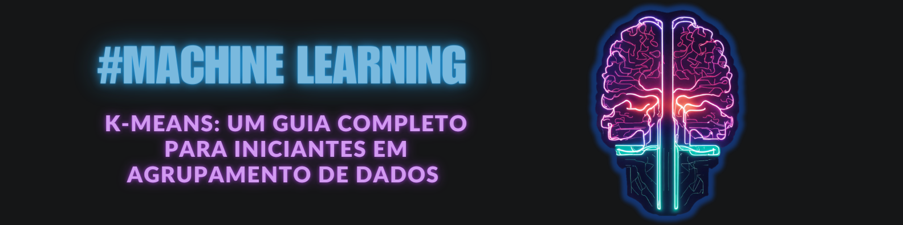

<p align="center">
    
</p>

# K-Means: Um Guia Completo para Iniciantes em Agrupamento de Dados

**Alessandra Araujo**
26/06/2024 21:30

### Introdução

🤖 Olá! Hoje vamos explorar o K-Means, um algoritmo muito legal usado em Machine Learning para agrupar dados semelhantes. Ele é super útil para entender melhor conjuntos de dados grandes e complexos. Vamos aprender como ele funciona, como usá-lo e algumas dicas para melhorar seus resultados.

<p align="center">
    
</p>

O K-Means é um algoritmo de agrupamento que organiza dados em grupos, chamados de clusters. Ele é chamado de "K-Means" porque você escolhe o número de clusters (K) que deseja criar e o algoritmo tenta encontrar os melhores "centros" para esses clusters. Por exemplo, em um conjunto de dados de pontos em um gráfico, o K-Means agrupa pontos que estão próximos uns dos outros.

## Como Funciona?

O K-Means funciona assim:

1. Escolhemos quantos clusters (K) queremos.
2. O algoritmo escolhe K pontos aleatórios como centros iniciais.
3. Cada ponto do conjunto de dados é atribuído ao centro mais próximo.
4. Os centros são recalculados como a média dos pontos atribuídos a eles.
5. Repetimos os passos 3 e 4 até que os centros não mudem mais (ou mudem muito pouco).

São utilizadas métricas para calcular a distância entre os pontos e os centros, para determinar quais pontos estão mais próximos de cada centro, formando os conjuntos de dados. Essas métricas oferecem diferentes formas de medir a similaridade ou dissimilaridade entre os pontos, e a escolha da métrica pode depender da natureza dos dados e do problema específico que você está tentando resolver.

Entre as métricas mais usadas estão:
 - Distância Euclidiana:  É a métrica mais utilizada e representa a distância "reta" entre dois pontos no espaço n-dimensional.
 - Distância Manhattan: Calcula a soma das distâncias absolutas das diferenças das coordenadas. Também é conhecida como "distância do táxi", pois representa a distância percorrida em um grid urbano.
 - Distância de Mahalanobis: Leva em conta as correlações entre as variáveis e é útil para dados multivariados
 - Distância de Coseno: Mede o ângulo entre dois vetores, sendo útil para dados de alta dimensionalidade onde a orientação dos vetores é mais importante que sua magnitude.

## Preparando os Dados

Antes de usar o K-Means, precisamos preparar nossos dados. Isso inclui:

- **Limpeza dos dados:** Remover dados faltantes ou errôneos.
- **Normalização:** Ajustar os valores para que estejam na mesma escala. Isso é importante porque o K-Means usa distâncias para agrupar pontos.
- **Seleção de características:** Escolher quais características dos dados usar no agrupamento.

<p align="center">
    
</p>

Vamos ver como implementar o K-Means em Python usando a biblioteca Scikit-learn. Primeiro, importamos as bibliotecas necessárias e criamos alguns dados de exemplo:

```python
from sklearn.cluster import KMeans
import numpy as np

# Criando alguns dados de exemplo
dados = np.array([[1, 2], [1, 4], [1, 0],
                  [4, 2], [4, 4], [4, 0]])

# Aplicando o K-Means com 2 clusters
kmeans = KMeans(n_clusters=2)
kmeans.fit(dados)

# Vendo os grupos
print(kmeans.labels_)
```

## Visualizando os Clusters

Visualizar os clusters pode ajudar a entender melhor como os dados foram agrupados. Podemos usar a biblioteca Matplotlib para isso:

```python
import matplotlib.pyplot as plt

# Desenhando os pontos e os clusters
plt.scatter(dados[:, 0], dados[:, 1], c=kmeans.labels_, cmap='viridis')
plt.scatter(kmeans.cluster_centers_[:, 0], kmeans.cluster_centers_[:, 1], s=300, c='red', marker='X')
plt.show()
```

## Escolhendo o Número de Clusters

Escolher o número certo de clusters (K) é crucial. Métodos como o Elbow Method e Silhouette Score ajudam nisso. O Elbow Method envolve plotar a soma das distâncias quadráticas dentro dos clusters e procurar um "cotovelo" na curva. O Silhouette Score mede a coesão e separação dos clusters.

## Desafios Comuns

O K-Means pode enfrentar alguns desafios, como:

- **Clusters de tamanhos diferentes:** K-Means pode ter dificuldade com clusters que têm tamanhos muito diferentes.
- **Clusters não esféricos:** O algoritmo assume que os clusters são esféricos, o que nem sempre é verdade.
- **Pontos de dados fora do comum:** Pontos fora do comum (outliers) podem distorcer os resultados.

Para mitigar esses problemas, podemos usar o K-Means++, que melhora a escolha inicial dos centros.

## Avaliação dos Clusters

Após agrupar os dados, precisamos avaliar a qualidade dos clusters. Algumas métricas incluem:

- **Inércia (Soma das Distâncias Quadráticas):** Quanto menor, melhor.
- **Silhouette Score:** Mede a coesão dentro dos clusters e a separação entre os clusters. Valores mais altos indicam clusters melhores.

## Conclusão

Agora você sabe como usar o K-Means para agrupar dados! É uma ferramenta poderosa em Machine Learning. Continue explorando e experimentando com diferentes conjuntos de dados e técnicas. Para mais dicas e conteúdos, me siga no [Linkedin](https://www.linkedin.com/in/alessandra-araujo-a583a2296/)!

#### _Ilustrações de capa gerada por: lexica.art_
#### _Conteúdo gerado por: ChatGPT com revisões humanas_

#MachineLearning #KMeans #DataScience

---

**Me siga para mais**

Gostou do que aprendeu? Me siga no[Linkedin](https://www.linkedin.com/in/alessandra-araujo-a583a2296/) para mais dicas incríveis sobre Machine Learning e Data Science! Meu 

## ⚒️Ferrramentas de produção:

- Imagens geradas por: I.A. lexica.art e Remove.bg

- Editor de imagem: Canva e PowerPoint

- Conteúdo gerado por: ChatGPT 

- Revisões Humanas: Alessandra Araujo


